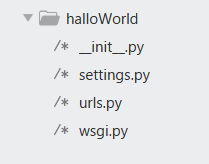

# DJANGO使用指南

>Auth: 王海飞
>Data：2018-03-21
>Email：779598160@qq.com
>github：https://github.com/coco369/knowledge

---

#### 创建Django项目

##### 1. 首先创建一个运行Django项目的虚拟环境(virtualenv)

虚拟环境的创建在基础课程中讲解，[地址]()
该虚拟环境中有django库，python3，pymysql等等需要的库

##### 2. 创建一个Django项目

2.1 创建项目
```
django-admin startproject halloWorld
```
该命令是创建一个名为halloWorld的工程

###### 项目目录介绍
下面展示创建以后的文件，具体有哪些文件：


manage.py： 是Django用于管理本项目的管理集工具，之后站点运行，数据库自动生成，数据表的修改等都是通过该文件完成。

__init__.py： 指明该目录结构是一个python包，暂无内容，在后期会初始化一些工具会使用到。

seetings.py： Django项目的配置文件，其中定义了本项目的引用组件，项目名，数据库，静态资源，调试模式，域名限制等

urls.py：项目的URL路由映射，实现客户端请求url由哪个模块进行响应。

wsgi.py：定义WSGI接口信息，通常本文件生成后无需改动

2.2 创建app
```
python manage.py startapp hallo_app
```
该命令是在blog工程下创建一个名为hallo_app的app


