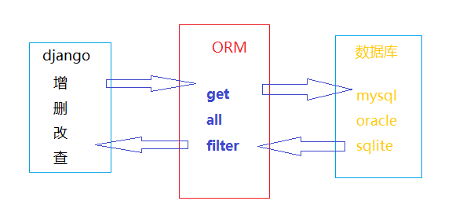

# 模型使用指南

>Auth: 王海飞
>Data：2018-03-21
>Email：779598160@qq.com
>github：https://github.com/coco369/knowledge

### 前言
　　Django对数据库提供了很好的支持，对不同的数据库,django提供了统一调用的API，我们可以根据不同的业务需求使用不同是数据库。Django中引入了ORM(Objects Relational Mapping)对象关系映射，是一种程序技术。在下面会详细的讲解。

#### 修改mysql配置

##### 1. 在settings.py中配置数据库连接信息
```
'ENGINE':'django.db.backends.mysql',
'NAME':'',           #数据库名
'USER':'',           #账号
'PASSWORD':'',       #密码
'HOST':'127.0.0.1',  #IP(本地地址也可以是localhost)
'PORT':'3306',       #端口
```

##### 2. mysql数据库中创建定义的数据库
a) 进入mysql
```
mysql -u root -p
```
b) 创建数据库
```
create database xxx charset=utf-8;
```

##### 3. 配置数据库链接


a) 安装pymysql
```
pip install pymysql

```

b) 在工程目录下的__init__.py文件中输入,完成数据库的驱动加载
```
import pymysql
pymysql.install_as_MySQLdb()
```

##### 4. 定义模型

######重要概念：模型，表，属性，字段

一个模型类在数据库中对应一张表，在模型类中定义的属性，对应模型对照表中的一个字段

定义属性见定义属性文件[地址]()

###### 创建学生模型类
class Student(models.Model):

    s_name = models.CharField(max_length=10)
    s_age = models.IntegerField()
    s_gender = models.BooleanField()

    class Meta:
        db_table = 'cd_student'
        ordering =[]
    对象的默认排序字段，获取对象列表时使用，升序ordering['id']，降序ordering['-id']


##### 5.迁移数据库

a) 生成迁移文件
```
python manage.py makemigrations
```

b) 执行迁移生成数据库 
```
python manage.py migrate
```
注意: 生成迁移文件的时候，并没有在数据库中生成对应的表，而是执行migrate命令之后才会在数据库中生成表


##### 6. ORM
ORM(Objects Relational Mapping)对象关系映射，是一种程序技术，用于实现面向对象编程语言里不同类型系统的数据之间的转换。可以简单理解为翻译机。





