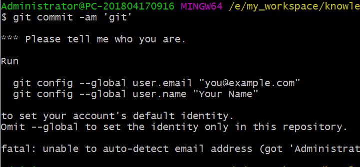
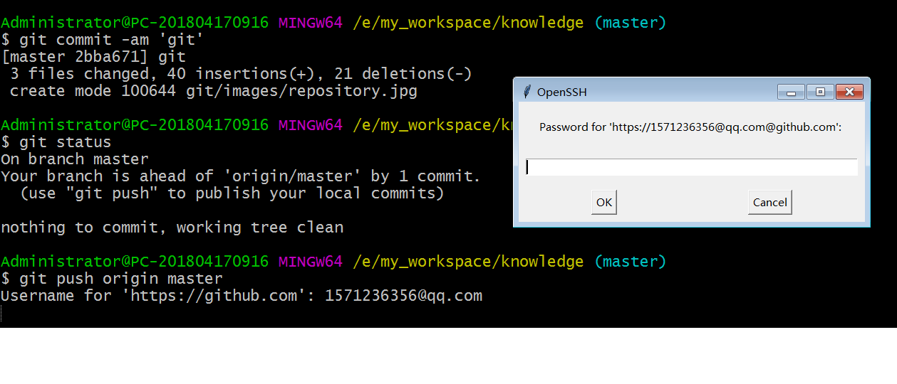

# GIT使用指南

>Auth: 王海飞
>Data：2018-03-19
>Email：779598160@qq.com
>github：https://github.com/coco369/knowledge

---


**前言**：
##### 什么是git
git是<u>分布式版本控制系统</u>。分布式版本控制系统也还有svn。

##### 什么是分布式控制，什么是集中式控制系统

集中式版本控制，主要有SVN。该模式的版本控制是由一台电脑作为中央服务器，程序猿工作的时候用自己的电脑先要从中央服务器上把代码给拉取(pull)下来，
然后在编写自己的代码，最后提交代码到中央服务器上。该模式下必须联网才能完成操作。


分布式控制，主要有Git。该模式的版本控制没有中央服务器的概念，每一个程序猿的电脑都是一个版本库。也就是说，每一个程序猿的电脑上都有整个项目的代码，
不只是自己版本的代码，还有其他人的版本的代码。所以要是换同事程序猿的电脑挂了，从你的电脑上一样的可以把他写的分支上的代码给copy出来。当然在正式
开发中还是有一个类似于中央服务器的一台服务器，我们自己电脑的代码还是需要推到该服务器上，最后通过该服务器整合代码发布到线上测试环境去进行测试以
及上线。


```
在程序猿小哥哥的电脑上一般会涉及到到三个分支：
master(线上分支)，dev(开发环境分支)，test(测试分支)，wanghaifei(自己开发分支)
```


##### git的一些基本概念

###### 1. 设置全局变量



###### 2.git工作区域
    git工作区域分为工作区，缓存区
    工作区其实就是整个项目的文件目录，其中有很多一个隐藏文件叫.git，该文件就是git的版本库。在该.git文件中有很多配置文件，最重要的是就是stage
    或者叫index的暂存区，还有git在我们创建项目的时候默认创建了第一个master分支，以及指向该master分支的一个指针head。
    该图说明
    <br>
    

    那提交怎么从本地到缓存区以及最后到远程的分支上的呢：
    1. 首先第一步git add其实就是讲我们本地修改了的代码提交到缓存区中
    2. 第二部git commit就是讲我们缓存区中的代码提交到本地分支中，并清空缓存区域
    3. 最后一步git push origin master，就是讲我们本地分支的代码推到远程remote的master分支上


###### 3. git提交代码
设置了全局变量以后，在以后的每一次提交代码都会提示输入git的username和对于的密码


##### git秘钥设置

git@github.com:coco369/knowledges.git
https://github.com/coco369/knowledges.git

***

##### 使用git命令完成以下操作：

###### 基础操作
1. 克隆github或者码云上代码到本地
```
git clone 分支名仓库名地址
```
一般拉取下来的代码，当前分支都在master分支上

2. 创建自己的分支
```
git checkout -b wanghaifei
```

3. 查看当前修改文件的状态
```
git status
```

4. 添加要上传的文件
```
git add 修改后的文件
```

5. 提交添加文件的注解
```
git commit -m '注解'
```

6. 文件到本地分支中
```
git push origin wanghaifei
```

7. 合并添加上传文件和添加上传文件注解到本地分支的操作
```
git commit -am '注解'
```

8. 下拉远程自己分支代码到本地自己分支
```
git pull origin wanghaifei
```

***
###### 代码分支合并，tag提交

9. 将自己分支代码合并到测试分支以便测试人员测试
先切换版本到dev分支
```
git checkout dev
```
当前dev分支在合并wanghaifei分支
```
git merge wanghaifei
```
提交dev分支合并的代码到远程dev分支上
```
git push origin dev
```

10. 上线代码需要打tag，在master分支打tag
打版本v1.0.0.0
```
git tag -a 版本号 -m '注解'
```
提交版本v1.0.0.0
```
git push origin v1.0.0.0
```

***
###### 分支版本处理

11. 删除本地分支
```
git branch -D wanghaifei
```

12. 删除git远程分支
```
git push origin --delete wanghaifei
```

13. 删除本地tag
```
git tag -d v1.0.0.0
```

14. 删除git远程tag
```
git push origin --delete tag v1.0.0.0
```


15. 查看dev分支和wanghaifei分支的不同
```
git diff dev wanghaifei
```

***
###### 缓存机制，在某一个分支修改了代码，但是不想提交该分支，又想切换到另外一个分支在修改相同的代码，就需要使用stash命令

16. 缓存本地修改的代码
```
git stash
```
缓存之后，在git status去查看修改代码记录会发现提示 nothing to commit，working tree clean。说明刚才修改的代码都缓存起来了

17. 查看缓存的片段
```
git stash list 
```
发现有缓存列表，刚才缓存的记录为 stash@{0}: XXXXXXXXXX

18. 还原缓存的代码
```
git stash apply stash@{0}
```

***
###### 查看某次提交的详情，退回代码到某一次提交

19. 查看提交的日志记录
```
git log
```
例如结果提交信息的日志如下：
```
commit f9838aa51ca5ccd603e1e8cbd347a43c9cd2e0be
Merge: f5847ec 52dc6fa
Author: wanghaifei <779598160@qq.com>
Date:   Mon Jan 29 17:15:34 2018 +0800

    Merge branch 'whf_p0' into dev

commit 52dc6fa34f36fae981d1c347825af93a150308fa
Author: wanghaifei <779598160@qq.com>
Date:   Mon Jan 29 17:15:22 2018 +0800

    完成预约增加预约到店时间

```

20. 查看某次提交的内容
```
git show commit-id
```

21. 退回代码
回退到当前版本用HEAD表示当前版本，上一个版本是HEAD^,或者使用<u>HEAD~1</u>，表示上一个版本。HEAD后面是数字可以一直往大了写，只要有那么多老版本
```
git reset --hard
```


