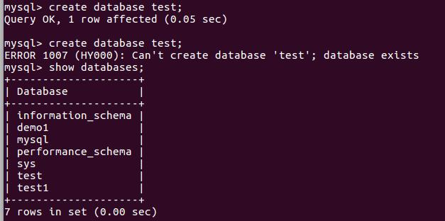
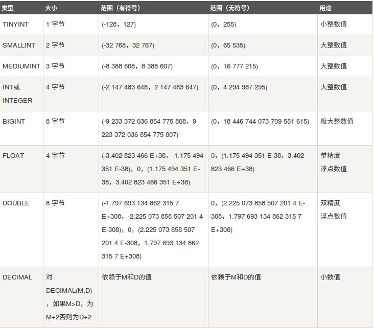
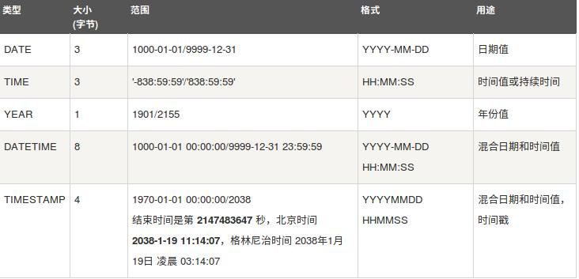
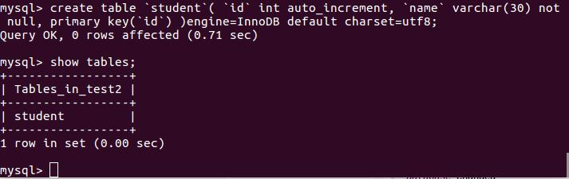
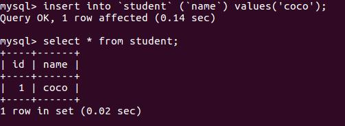
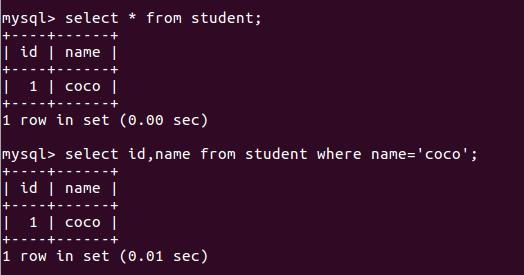
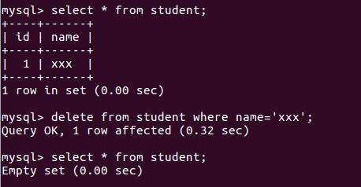

# Mysql数据库使用指南

>Auth: 王海飞
>Data：2018-04-13
>Email：779598160@qq.com
>github：https://github.com/coco369/knowledge

### 前言

#### 什么是数据库？
 数据库（Database）是按照数据结构来组织、存储和管理数据的仓库，

每个数据库都有一个或多个不同的API用于创建，访问，管理，搜索和复制所保存的数据。

我们也可以将数据存储在文件中，但是在文件中读写数据速度相对较慢。

所以，现在我们使用关系型数据库管理系统（RDBMS）来存储和管理的大数据量。所谓的关系型数据库，是建立在关系模型基础上的数据库，借助于集合代数等数学概念和方法来处理数据库中的数据。

RDBMS即关系数据库管理系统(Relational Database Management System)的特点：

    1.数据以表格的形式出现
    2.每行为各种记录名称
    3.每列为记录名称所对应的数据域
    4.许多的行和列组成一张表单
    5.若干的表单组成database

##### RDBMS 术语

在我们开始学习MySQL 数据库前，让我们先了解下RDBMS的一些术语：

    数据库: 数据库是一些关联表的集合。
    数据表: 表是数据的矩阵。在一个数据库中的表看起来像一个简单的电子表格。
    列: 一列(数据元素) 包含了相同的数据, 例如邮政编码的数据。
    行：一行（=元组，或记录）是一组相关的数据，例如一条用户订阅的数据。
    冗余：存储两倍数据，冗余降低了性能，但提高了数据的安全性。
    主键：主键是唯一的。一个数据表中只能包含一个主键。你可以使用主键来查询数据。
    外键：外键用于关联两个表。
    复合键：复合键（组合键）将多个列作为一个索引键，一般用于复合索引。
    索引：使用索引可快速访问数据库表中的特定信息。索引是对数据库表中一列或多列的值进行排序的一种结构。类似于书籍的目录。
    参照完整性: 参照的完整性要求关系中不允许引用不存在的实体。与实体完整性是关系模型必须满足的完整性约束条件，目的是保证数据的一致性。

### window上Mysql安装

下载安装地址[mysql地址](https://www.mysql.com/)


### ubuntu上Mysql安装

安装参数
```
MySQL - MySQL服务器。你需要该选项，除非你只想连接运行在另一台机器上的MySQL服务器。
MySQL-client - MySQL 客户端程序，用于连接并操作Mysql服务器。
```


#### 1.安装mysql:
```
sudo apt-get install mysql mysql-client
```

#### 2.使用Mysql客户端进行连接Mysql的命令

先使用mysql命令连接到mysql的服务器，输入安装的时候自己设置的密码
```
mysql -u root -p
``` 
然后输入mysql的密码即可进入mysql数据库中

如下就是进入mysql中的图：


#### 3.简单的SQL命令

##### 3.1查看当前mysql中有那些数据库

```
show databases;
```
如下展示了mysql中已存在的数据库


##### 3.2创建/删除自定义的数据库

###### 创建数据库

创建数据库的时候，需要指定编码charset=utf-8,要不然存储中文会出现乱码

```
create database test charset=utf8;
```




注意：1.  create database 语句的后面是要创建的数据库名称。建议数据库名称尽可能是有意义和具有一定的描述性。

      2. 重复创建同一个数据库是会提示你，数据库已经存在了


改进方案：
```
create database if not exists database_name
```

注意: if not exists是语句的可选子句。 if not exists子句可防止创建数据库服务器中已存在的新数据库的错误。不能在MySQL数据库服务器中具有相同名称的数据库。


###### 删除数据库

```
drop database test;
```


注意：删除重复的同一个数据库的时候是会提醒你，数据库不存在了

改进方案：
```
drop database if exists test;
```
注意：与create database语句类似，if exists是该语句的可选部分，以防止您删除数据库服务器中不存在的数据库。


##### 3.3选择数据库

你连接到 MySQL 数据库后，可能有多个可以操作的数据库，所以你需要选择你要操作的数据库。 必须通过使用USE语句告诉MySQL要使用哪个数据库。
```
use test;
```
从现在开始，所有操作(如查询数据，创建新表, 增加表数据，删除表数据)都将对当前数据库(即test)产生影响。


##### 3.4数据类型

MySQL支持多种类型，大致可以分为三类：数值、日期/时间和字符串(字符)类型。 

数值类型：
<br>


日期和时间类型：
表示时间值的日期和时间类型为DATETIME、DATE、TIMESTAMP、TIME和YEAR。
每个时间类型有一个有效值范围和一个"零"值，当指定不合法的MySQL不能表示的值时使用"零"值。
<br>


字符串类型：
<br>


##### 3.5创建表

创建MySQL数据表需要以下信息：

    表名
    表字段名
    定义每个表字段

语法：
    create table table_name (column_name column_type);

```
create table `student`(
 `id` int auto_increment,
 `name` varchar(30) not null,
 primary key(`id`) 
)engine=InnoDB default charset=utf8;
```



解析：
1. 如果你不想字段为空 可以设置字段的属性为 NOT NULL， 在操作数据库时如果输入该字段的数据为NULL ，就会报错。
2. AUTO_INCREMENT定义列为自增的属性，一般用于主键，数值会自动加1。
3. INT 定义的字段为整形
4. VARCHAR 定义可变的字符串，最大的长度为30。
5. PRIMARY KEY关键字用于定义列为主键。
6. ENGINE 设置存储引擎。
7. CHARSET 设置编码。

##### 3.6删除表
删除表的语法很简单，删除表的同时，表里面的所有信息都会被删除掉，所以该操作需要很小心。

语法：
    drop table table_name ;


***


##### 3.7增数据
语法：
    inset into table_name (file1, file2, file3) values (value1, value2, value3)

```
insert into `student` (`name`) values('coco');
```



##### 3.8查数据

语法：
    select column_name1, column_name2 
    from table_name
    [where]
    [limit n] [offset m]

注解：

    1）查询语句中你可以使用一个或者多个表，表之间使用逗号(,)分割，并使用WHERE语句来设定查询条件。
    2）SELECT 命令可以读取一条或者多条记录。
    3）可以使用星号（*）来代替其他字段，SELECT语句会返回表的所有字段数据
    4）可以使用 WHERE 语句来包含任何条件。
    5）可以使用 LIMIT 属性来设定返回的记录数。
    6）可以通过OFFSET指定SELECT语句开始查询的数据偏移量。默认情况下偏移量为0。

```
select id,name from student where name='coco';
```


<br>

##### 3.9改数据

语法：
    update table_name set field1=value1 fields2=value2 
    [where]

注解： 
    1) 可以同时更新一个或多个字段。
    2) 可以在 WHERE 子句中指定任何条件。

```
update student set name='xxx' where id=1;
```

<br>


##### 3.10删数据

语法：
    delete from table_name [where]

注解：
    1）如果没有指定 WHERE 子句，MySQL 表中的所有记录将被删除。

```
delete from student where name='xxx';
```



