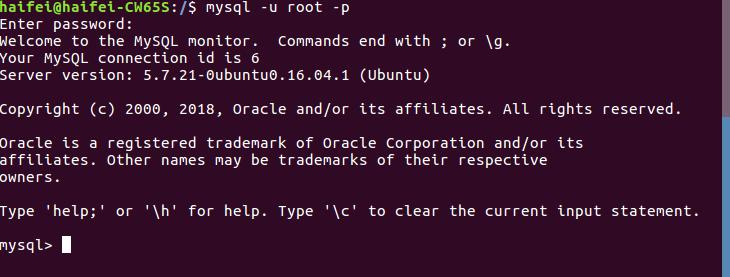
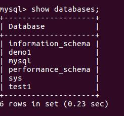

# Mysql数据库使用指南

>Auth: 王海飞
>Data：2018-04-13
>Email：779598160@qq.com
>github：https://github.com/coco369/knowledge

### 前言

#### 什么是数据库？
 数据库（Database）是按照数据结构来组织、存储和管理数据的仓库，

每个数据库都有一个或多个不同的API用于创建，访问，管理，搜索和复制所保存的数据。

我们也可以将数据存储在文件中，但是在文件中读写数据速度相对较慢。

所以，现在我们使用关系型数据库管理系统（RDBMS）来存储和管理的大数据量。所谓的关系型数据库，是建立在关系模型基础上的数据库，借助于集合代数等数学概念和方法来处理数据库中的数据。

RDBMS即关系数据库管理系统(Relational Database Management System)的特点：

    1.数据以表格的形式出现
    2.每行为各种记录名称
    3.每列为记录名称所对应的数据域
    4.许多的行和列组成一张表单
    5.若干的表单组成database

##### RDBMS 术语

在我们开始学习MySQL 数据库前，让我们先了解下RDBMS的一些术语：

    数据库: 数据库是一些关联表的集合。
    数据表: 表是数据的矩阵。在一个数据库中的表看起来像一个简单的电子表格。
    列: 一列(数据元素) 包含了相同的数据, 例如邮政编码的数据。
    行：一行（=元组，或记录）是一组相关的数据，例如一条用户订阅的数据。
    冗余：存储两倍数据，冗余降低了性能，但提高了数据的安全性。
    主键：主键是唯一的。一个数据表中只能包含一个主键。你可以使用主键来查询数据。
    外键：外键用于关联两个表。
    复合键：复合键（组合键）将多个列作为一个索引键，一般用于复合索引。
    索引：使用索引可快速访问数据库表中的特定信息。索引是对数据库表中一列或多列的值进行排序的一种结构。类似于书籍的目录。
    参照完整性: 参照的完整性要求关系中不允许引用不存在的实体。与实体完整性是关系模型必须满足的完整性约束条件，目的是保证数据的一致性。

### ubuntu上Mysql安装

安装参数
```
 MySQL - MySQL服务器。你需要该选项，除非你只想连接运行在另一台机器上的MySQL服务器。
MySQL-client - MySQL 客户端程序，用于连接并操作Mysql服务器。
```


#### 安装mysql:
```
sudo apt-get install mysql mysql-client
```

#### 使用Mysql客户端进行连接Mysql的命令

先使用mysql命令连接到mysql的服务器，输入安装的时候自己设置的密码
```
mysql -u root -p
``` 
然后输入mysql的密码即可进入mysql数据库中

如下就是进入mysql中的图：


#### 简单的SQL命令

##### 查看当前mysql中有那些数据库

```
show databases;
```
如下展示了mysql中已存在的数据库



##### 创建自定义的数据库

创建数据库的时候，需要指定编码charset=utf-8,要不然存储中文会出现乱码
```
create database charset=utf8;
```


注意：重复创建同一个数据库是会提示你，数据库已经存在了


